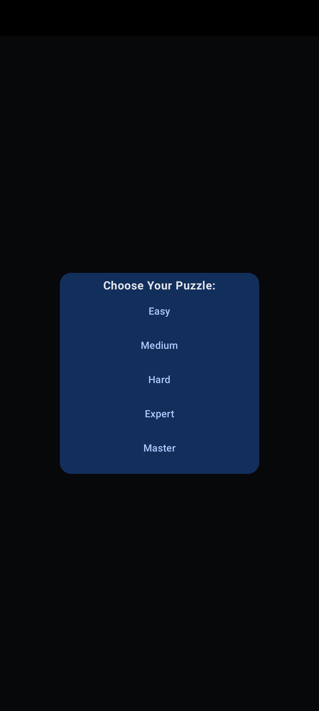
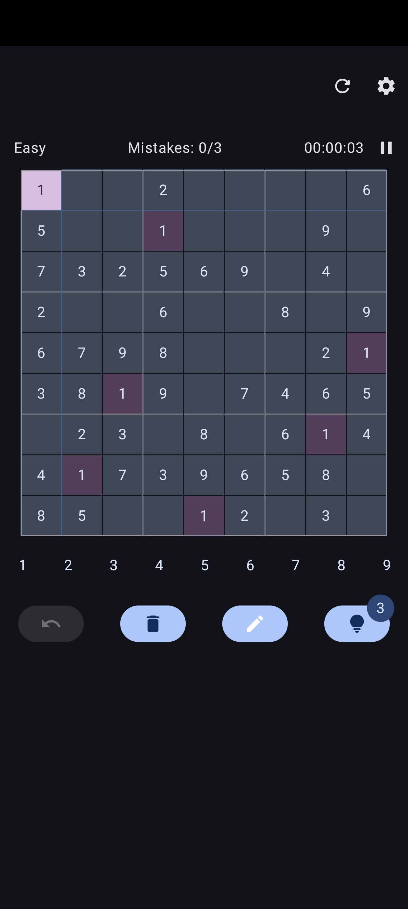
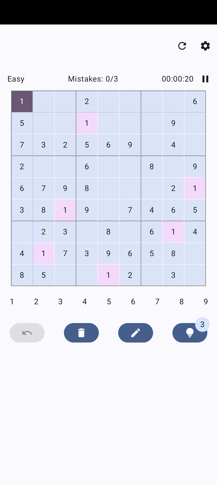
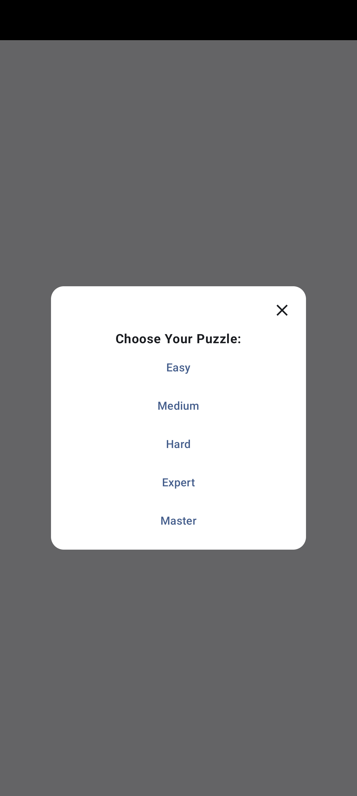
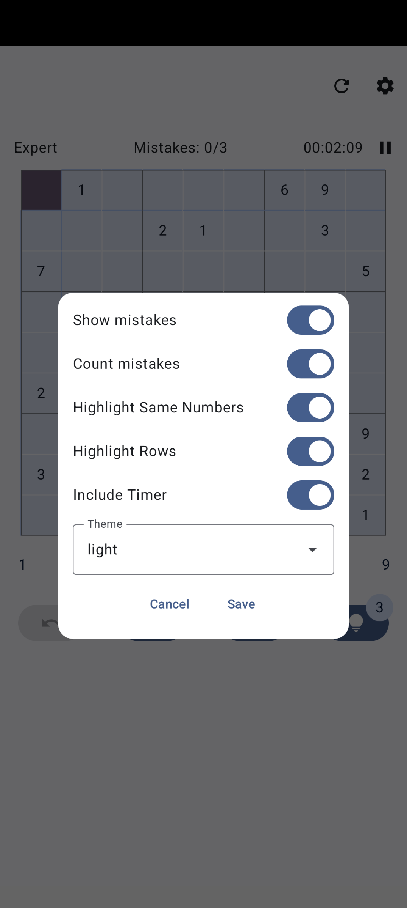
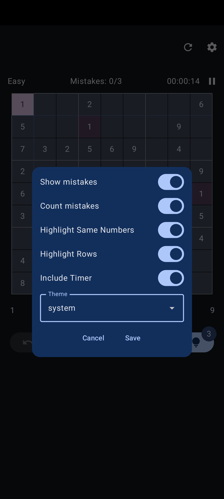
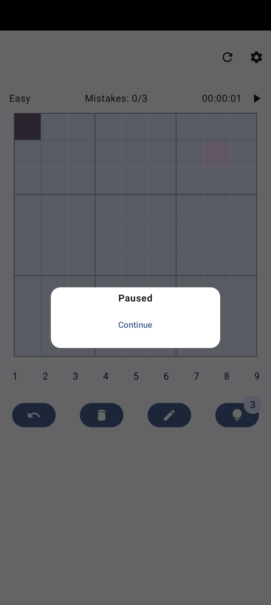
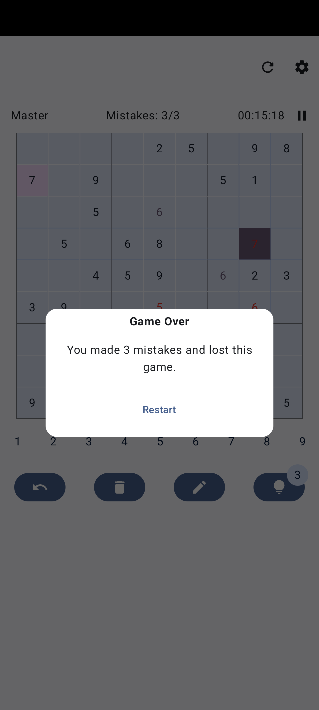
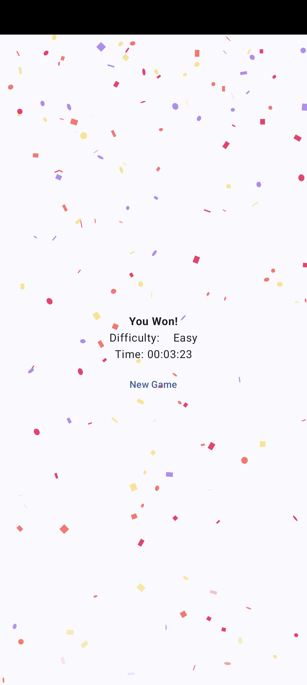

# Sudoku
This game is written in Kotlin using Jetpack Compose. DataStore was used to store the theme value - light/dark or based on the system.

As part of this project, custom android icon was produced that supports monochrome. Also, it offers predictive back gesture.

The app offers dark/light mode based on the user's selection but also offers landcape or portrait layout.

## How to use it
### Landing page

Select a level you would like to try winning. Based on the level, more empty cells are going to be available to fill in.

### Grid view

In the top row, you can see a restart icon that will take you to the level selection, which can be cancelled any time and you will be returned to your current game. Then a settings button, that will allow you to toggle on/off the following indicators, it also includes switching the theme:

- show mistakes
    - if selected, a wrong number is going to be highlighted in red
- count mistakes
    - if selected, the top row will indicate how many errors were made, after 3 mistakes the game will be over
- highlight same numbers
    - if selected, all numbers that are the same as the current selected cell will be highlighted
- highlight rows
    - if seletcted, the vertical and horizontal row is going to be highlighted for the selected cell
- include timer
    - if selected, the timer is going to be included as part of the game and be shown in the end screen.

In the next row, you can see the level of the current game, how many mistakes were made and timer which you can pause.

Below the grid, you can see the action buttons for the game (from left to right):
- Undo
    - Only available if a game was started and at least 1 step was made. All steps will be included - erase, insertings notes, inserting digitss.
- Erase
    - Inserted digits/notes will be erased from a selected cell.
- Notes
    - Allows to insert 1-9 digits into any cell. The insertion will be prevented if the selected digit already exists vertically/horizontally or in 3x3 box for the selected cell. An animation is going to scale those digits too, to indicate it clearer.
- Hint
    - Every game allows to use 3 hints that will unlock random 3 cells.

#### Restart

#### Settings:

#### Paused game

### Lose Screen

When you make 3 mistakes, the game is over (only if you enabled it from the settings).

### End Screen

Once you have insterted all digits correctly, you won the game. It uses [Konfetti](https://github.com/DanielMartinus/Konfetti). From this screen, you can start new game. All settings for the game are going to be reset, except theme. Theme is saved by DataStore.