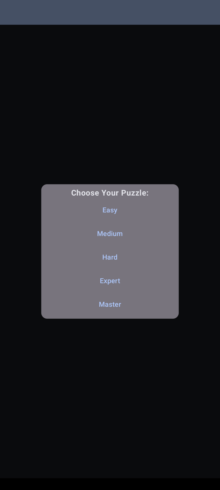
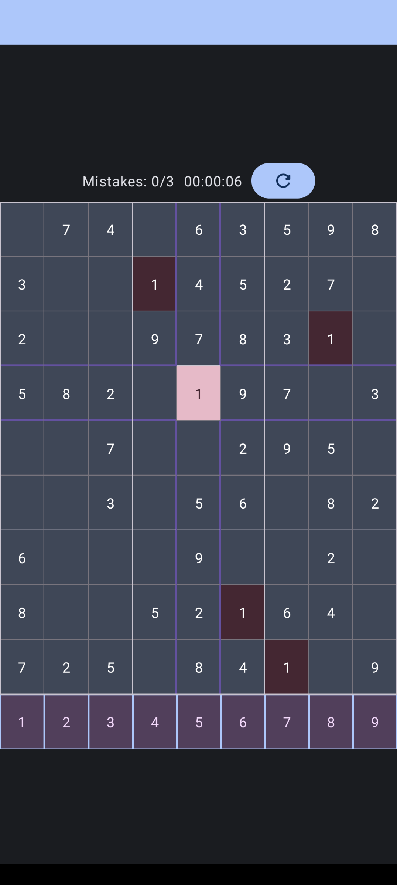
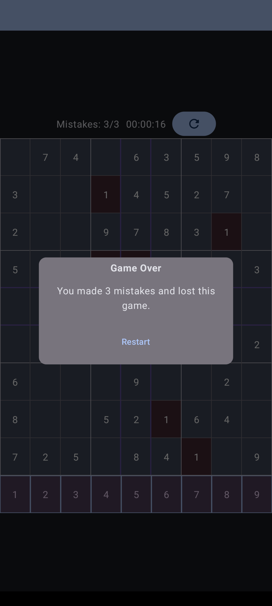

# Sudoku
This game is written in Kotlin using Jetpack Compose.
   

## Future improvements:
- Add undo/erase
- Add hints
- Modal for winning a game
- Support for dark/light mode
- Settings modal
- Confirmation modal for restarting if a user already attempted their current game
- Pause for a timer with a modal to unpause
